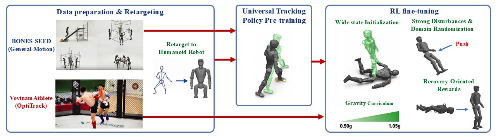

# VovinamAthlete
We present VovinamAthlete, a high-dynamic humanoid motion-tracking and fall-recovery framework together with an optical motion-capture dataset collected from trained Vietnamese Vovinam athletes

## Installation

### System requirements

- Ubuntu 22.04 (recommended)
- NVIDIA GPU with driver 550+

### 1. Create a virtual environment

Conda is recommended. If you don't already have it, install Miniconda:

```bash
mkdir -p ~/miniconda3
wget https://repo.anaconda.com/miniconda/Miniconda3-latest-Linux-x86_64.sh -O ~/miniconda3/miniconda.sh
bash ~/miniconda3/miniconda.sh -b -u -p ~/miniconda3
rm ~/miniconda3/miniconda.sh
~/miniconda3/bin/conda init --all
source ~/.bashrc
```

Create and activate an environment:

```bash
conda create -n vovinamathlete python=3.11
conda activate vovinamathlete
```

### 2. Clone the repository

This repo stores its robot meshes/USD files via [Git LFS](https://git-lfs.com/) — install `git-lfs` before cloning, or the mesh files will come down as text pointers instead of real data:

```bash
git lfs install
git clone https://github.com/aralab-unr/VovinamAthlete.git
cd VovinamAthlete
```

If you cloned before installing `git-lfs`, run `git lfs pull` afterward to fetch the real files.

### 3. Install dependencies

All Python dependencies (`mjlab`, `mujoco-warp`, etc.) are declared in `setup.py`:

```bash
pip install -e .
```

### 4. Verify the install

```bash
python -c "import vovinamathlete_mjlab.tasks; from mjlab.tasks.registry import list_tasks; print([t for t in list_tasks() if 'VD' in t])"
```

This should print the registered tasks: `['VD03-Tracking', 'VD03-Tracking-No-State-Estimation', 'VD03-Tracking-Standing']`.

### 5. Training

Training is a two-stage pipeline: pre-train a universal tracking policy on a broad motion dataset, then fine-tune it on the Vovinam motion-capture data.

#### Data preparation

Prepare the retargeted motion as `.pkl` files in GMR format, then convert them to a folder of `.npz` clips:

```bash
python scripts/pkl_to_csv.py --input_dir /path/to/pkl_output --output_dir /path/to/csv
python scripts/csv_to_npz.py --input-dir /path/to/csv --output-dir /path/to/motions
```

#### Stage 1: Universal tracking pre-training

Train on a broad motion dataset first:

```bash
python scripts/train.py VD03-Tracking-No-State-Estimation --motion-file /path/to/motions --env.scene.num-envs=8196
```

#### Stage 2: Fine-tune on Vovinam motions

Once the universal policy is trained, retarget the Vovinam motion-capture data to your robot the same way, then fine-tune from the universal policy's checkpoint:

```bash
python scripts/train.py VD03-Tracking-Standing \
  --motion-file vovinamathlete_mjlab/assets/motions/vd03/newvovinamnpz \
  --env.scene.num-envs 8196 \
  --agent.resume True \
  --agent.load-run <your-run-name> \
  --agent.load-checkpoint <your-checkpoint>.pt
```

- The first argument selects the task: `VD03-Tracking`, `VD03-Tracking-No-State-Estimation`, or `VD03-Tracking-Standing`.
- `--motion-file` points to a single `.npz` clip, a directory of `.npz` clips, or a `.yaml` dataset config (see `vovinamathlete_mjlab/utils/motion_dataset.py`).
- `--agent.resume True --agent.load-run <run_dir> --agent.load-checkpoint <checkpoint.pt>` resumes/fine-tunes from a specific checkpoint under `logs/rsl_rl/<experiment_name>/<run_dir>/`.

Checkpoints and configs are saved under `logs/rsl_rl/<experiment_name>/<date_time>/`.

## Methodology & Datasets

### Summary 

Highly dynamic humanoid motion tracking remains challenging because aggressive whole-body motions can quickly drive the robot far from the reference trajectory and into fallen states. To address this, we present VovinamAthlete, a high-dynamic motion-tracking and fall-recovery framework built on an optical motion-capture dataset collected from trained Vietnamese Vovinam athletes. The framework first pre-trains a universal whole-body tracking policy on BONES-SEED, then fine-tunes it on Vovinam motions with randomized failure states and a progressive gravity curriculum, enabling a single policy to both track dynamic martial-arts motions and recover from falls without a separate recovery controller or predefined get-up trajectory.


*Overview of the VovinamAthlete training pipeline. (1) Data preparation and retargeting: Whole-body motion references are obtained from the large-scale BONES-SEED dataset and from trained Vovinam athletes captured using an OptiTrack motion-capture system. Both motion sources are retargeted to the target humanoid embodiment to generate robot-compatible reference trajectories. (2) Universal tracking policy pre-training: The general motions from BONES-SEED are used to pre-train a universal whole-body motion-tracking policy. This policy learns a broad motion prior and can reproduce diverse locomotion, daily activities, and other whole-body behaviors, but is not yet specialized for the highly dynamic motions of Vovinam. (3) Vovinam specialization and recovery-aware RL fine-tuning: Starting from the pre-trained universal policy, reinforcement-learning fine-tuning is continued using the VovinamAthlete dataset while exposing the robot to challenging initial conditions, disturbed and fallen states, and a progressive gravity curriculum. This stage specializes the policy for highly dynamic Vovinam motions while simultaneously improving its ability to recover from tracking failures and return to a stable, trackable state.*

### Datasets

### Video

## Results
### Simulation Results

<table>
  <tr>
    <td align="center">
      <b>Chien Luoc 1</b><br/>
      <video src="doc/videos/chien_luoc_01_002_rd03_120hz_final.mp4" width="140" controls muted playsinline></video><br/>
      <a href="doc/videos/chien_luoc_01_002_rd03_120hz_final.mp4">Watch</a>
    </td>
    <td align="center">
      <b>Chien Luoc 2</b><br/>
      <video src="doc/videos/chien_luoc_02_002_rd03_120hz_final.mp4" width="140" controls muted playsinline></video><br/>
      <a href="doc/videos/chien_luoc_02_002_rd03_120hz_final.mp4">Watch</a>
    </td>
    <td align="center">
      <b>Dam Da Tu Do 1</b><br/>
      <video src="doc/videos/dam_da_tu_do_002_rd03_120hz.mp4" width="140" controls muted playsinline></video><br/>
      <a href="doc/videos/dam_da_tu_do_002_rd03_120hz.mp4">Watch</a>
    </td>
    <td align="center">
      <b>Dam Da Tu Do 2</b><br/>
      <video src="doc/videos/dam_da_tu_do_002_rd03_120hz_final.mp4" width="140" controls muted playsinline></video><br/>
      <a href="doc/videos/dam_da_tu_do_002_rd03_120hz_final.mp4">Watch</a>
    </td>
    <td align="center">
      <b>Dam Len Goi</b><br/>
      <video src="doc/videos/dam_len_goi_001_rd03_120hz.mp4" width="140" controls muted playsinline></video><br/>
      <a href="doc/videos/dam_len_goi_001_rd03_120hz.mp4">Watch</a>
    </td>
    <td align="center">
      <b>Dam Tay Khong 1</b><br/>
      <video src="doc/videos/dam_tay_khong_01_003_rd03_120hz_final.mp4" width="140" controls muted playsinline></video><br/>
      <a href="doc/videos/dam_tay_khong_01_003_rd03_120hz_final.mp4">Watch</a>
    </td>
  </tr>
  <tr>
    <td align="center">
      <b>Dam Tay Khong 2</b><br/>
      <video src="doc/videos/dam_tay_khong_01_rd03_120hz.mp4" width="140" controls muted playsinline></video><br/>
      <a href="doc/videos/dam_tay_khong_01_rd03_120hz.mp4">Watch</a>
    </td>
    <td align="center">
      <b>Khoiquyen 1</b><br/>
      <video src="doc/videos/khoiquyen_take_2_001_rd03_120hz.mp4" width="140" controls muted playsinline></video><br/>
      <a href="doc/videos/khoiquyen_take_2_001_rd03_120hz.mp4">Watch</a>
    </td>
    <td align="center">
      <b>Khoiquyen 2</b><br/>
      <video src="doc/videos/khoiquyen_take_4_003_50_rd03_120hz.mp4" width="140" controls muted playsinline></video><br/>
      <a href="doc/videos/khoiquyen_take_4_003_50_rd03_120hz.mp4">Watch</a>
    </td>
    <td align="center">
      <b>Long Ho 1</b><br/>
      <video src="doc/videos/long_ho_01_002_rd03_120hz.mp4" width="140" controls muted playsinline></video><br/>
      <a href="doc/videos/long_ho_01_002_rd03_120hz.mp4">Watch</a>
    </td>
    <td align="center">
      <b>Long Ho 2</b><br/>
      <video src="doc/videos/long_ho_01_002_rd03_120hz_final.mp4" width="140" controls muted playsinline></video><br/>
      <a href="doc/videos/long_ho_01_002_rd03_120hz_final.mp4">Watch</a>
    </td>
    <td align="center">
      <b>Long Ho 3</b><br/>
      <video src="doc/videos/long_ho_01_003_rd03_120hz.mp4" width="140" controls muted playsinline></video><br/>
      <a href="doc/videos/long_ho_01_003_rd03_120hz.mp4">Watch</a>
    </td>
  </tr>
  <tr>
    <td align="center">
      <b>Long Ho 4</b><br/>
      <video src="doc/videos/long_ho_02_002_rd03_120hz.mp4" width="140" controls muted playsinline></video><br/>
      <a href="doc/videos/long_ho_02_002_rd03_120hz.mp4">Watch</a>
    </td>
    <td align="center">
      <b>Long Ho 5</b><br/>
      <video src="doc/videos/long_ho_02_003_rd03_120hz.mp4" width="140" controls muted playsinline></video><br/>
      <a href="doc/videos/long_ho_02_003_rd03_120hz.mp4">Watch</a>
    </td>
    <td align="center">
      <b>Long Ho 6</b><br/>
      <video src="doc/videos/long_ho_03_002_rd03_120hz.mp4" width="140" controls muted playsinline></video><br/>
      <a href="doc/videos/long_ho_03_002_rd03_120hz.mp4">Watch</a>
    </td>
    <td align="center">
      <b>Long Ho 7</b><br/>
      <video src="doc/videos/long_ho_03_003_rd03_120hz.mp4" width="140" controls muted playsinline></video><br/>
      <a href="doc/videos/long_ho_03_003_rd03_120hz.mp4">Watch</a>
    </td>
    <td align="center">
      <b>Ngu Mon 1</b><br/>
      <video src="doc/videos/ngu_mon_01_001_rd03_120hz.mp4" width="140" controls muted playsinline></video><br/>
      <a href="doc/videos/ngu_mon_01_001_rd03_120hz.mp4">Watch</a>
    </td>
    <td align="center">
      <b>Ngu Mon 2</b><br/>
      <video src="doc/videos/ngu_mon_02_002_rd03_120hz.mp4" width="140" controls muted playsinline></video><br/>
      <a href="doc/videos/ngu_mon_02_002_rd03_120hz.mp4">Watch</a>
    </td>
  </tr>
  <tr>
    <td align="center">
      <b>Ngu Mon 3</b><br/>
      <video src="doc/videos/ngu_mon_02_002_rd03_120hz_final.mp4" width="140" controls muted playsinline></video><br/>
      <a href="doc/videos/ngu_mon_02_002_rd03_120hz_final.mp4">Watch</a>
    </td>
    <td align="center">
      <b>Nhap Mon Quyen</b><br/>
      <video src="doc/videos/nhap_mon_quyen_01_half_3_002_rd03_120hz_final.mp4" width="140" controls muted playsinline></video><br/>
      <a href="doc/videos/nhap_mon_quyen_01_half_3_002_rd03_120hz_final.mp4">Watch</a>
    </td>
    <td align="center">
      <b>Phan The 1</b><br/>
      <video src="doc/videos/phan_the_1_004_new_5_rd03_120hz_final.mp4" width="140" controls muted playsinline></video><br/>
      <a href="doc/videos/phan_the_1_004_new_5_rd03_120hz_final.mp4">Watch</a>
    </td>
    <td align="center">
      <b>Phan The 2</b><br/>
      <video src="doc/videos/phan_the_4_004_rd03_120hz_final.mp4" width="140" controls muted playsinline></video><br/>
      <a href="doc/videos/phan_the_4_004_rd03_120hz_final.mp4">Watch</a>
    </td>
    <td align="center">
      <b>Phan The 3</b><br/>
      <video src="doc/videos/phan_the_4_006_rd03_120hz_final.mp4" width="140" controls muted playsinline></video><br/>
      <a href="doc/videos/phan_the_4_006_rd03_120hz_final.mp4">Watch</a>
    </td>
    <td align="center">
      <b>Thap Tu</b><br/>
      <video src="doc/videos/thap_tu_02_002_rd03_120hz_final.mp4" width="140" controls muted playsinline></video><br/>
      <a href="doc/videos/thap_tu_02_002_rd03_120hz_final.mp4">Watch</a>
    </td>
  </tr>
</table>
