# VovinamAthlete
We present VovinamAthlete, a high-dynamic humanoid motion-tracking and fall-recovery framework together with an optical motion-capture dataset collected from trained Vietnamese Vovinam athletes

## Installation

### System requirements

- Ubuntu 22.04 (recommended)
- NVIDIA GPU with driver 550+

### 1. Create a virtual environment

Conda is recommended. If you don't already have it, install Miniconda:

```bash
mkdir -p ~/miniconda3
wget https://repo.anaconda.com/miniconda/Miniconda3-latest-Linux-x86_64.sh -O ~/miniconda3/miniconda.sh
bash ~/miniconda3/miniconda.sh -b -u -p ~/miniconda3
rm ~/miniconda3/miniconda.sh
~/miniconda3/bin/conda init --all
source ~/.bashrc
```

Create and activate an environment:

```bash
conda create -n vovinamathlete python=3.11
conda activate vovinamathlete
```

### 2. Clone the repository

This repo stores its robot meshes/USD files via [Git LFS](https://git-lfs.com/) — install `git-lfs` before cloning, or the mesh files will come down as text pointers instead of real data:

```bash
git lfs install
git clone https://github.com/aralab-unr/VovinamAthlete.git
cd VovinamAthlete
```

If you cloned before installing `git-lfs`, run `git lfs pull` afterward to fetch the real files.

### 3. Install dependencies

All Python dependencies (`mjlab`, `mujoco-warp`, etc.) are declared in `setup.py`:

```bash
pip install -e .
```

### 4. Verify the install

```bash
python -c "import vovinamathlete_mjlab.tasks; from mjlab.tasks.registry import list_tasks; print([t for t in list_tasks() if 'VD' in t])"
```

This should print the registered tasks: `['VD03-Tracking', 'VD03-Tracking-No-State-Estimation', 'VD03-Tracking-Standing']`.

## Methodology & Datasets

### Summary 

Highly dynamic humanoid motion tracking remains challenging because aggressive whole-body motions can quickly drive the robot far from the reference trajectory and into fallen states. To address this, we present VovinamAthlete, a high-dynamic motion-tracking and fall-recovery framework built on an optical motion-capture dataset collected from trained Vietnamese Vovinam athletes. The framework first pre-trains a universal whole-body tracking policy on BONES-SEED, then fine-tunes it on Vovinam motions with randomized failure states and a progressive gravity curriculum, enabling a single policy to both track dynamic martial-arts motions and recover from falls without a separate recovery controller or predefined get-up trajectory.

### Datasets

### Video

## Results
### Simulation Results

<table>
  <tr>
    <td align="center">
      <a href="doc/videos/chien_luoc_01_002_rd03_120hz_final.mp4"></a><br/>
      <sub>Chien Luoc 01 002</sub>
    </td>
    <td align="center">
      <a href="doc/videos/chien_luoc_02_002_rd03_120hz_final.mp4">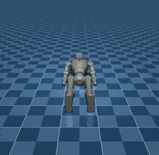</a><br/>
      <sub>Chien Luoc 02 002</sub>
    </td>
    <td align="center">
      <a href="doc/videos/dam_da_tu_do_002_rd03_120hz.mp4">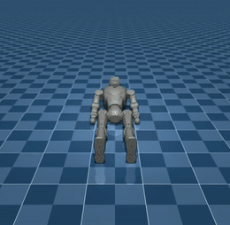</a><br/>
      <sub>Dam Da Tu Do 002</sub>
    </td>
  </tr>
  <tr>
    <td align="center">
      <a href="doc/videos/dam_da_tu_do_002_rd03_120hz_final.mp4">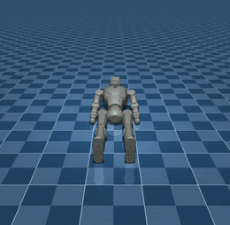</a><br/>
      <sub>Dam Da Tu Do 002</sub>
    </td>
    <td align="center">
      <a href="doc/videos/dam_len_goi_001_rd03_120hz.mp4">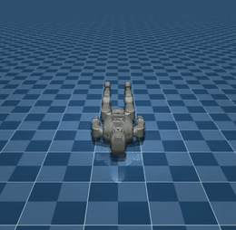</a><br/>
      <sub>Dam Len Goi 001</sub>
    </td>
    <td align="center">
      <a href="doc/videos/dam_tay_khong_01_003_rd03_120hz_final.mp4">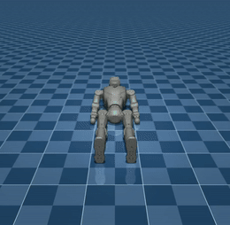</a><br/>
      <sub>Dam Tay Khong 01 003</sub>
    </td>
  </tr>
  <tr>
    <td align="center">
      <a href="doc/videos/dam_tay_khong_01_rd03_120hz.mp4">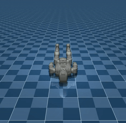</a><br/>
      <sub>Dam Tay Khong 01</sub>
    </td>
    <td align="center">
      <a href="doc/videos/khoiquyen_take_2_001_rd03_120hz.mp4">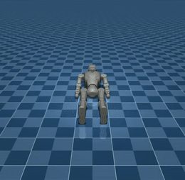</a><br/>
      <sub>Khoiquyen Take 2 001</sub>
    </td>
    <td align="center">
      <a href="doc/videos/khoiquyen_take_4_003_50_rd03_120hz.mp4">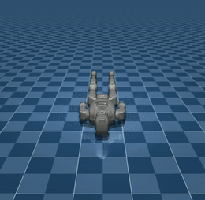</a><br/>
      <sub>Khoiquyen Take 4 003</sub>
    </td>
  </tr>
  <tr>
    <td align="center">
      <a href="doc/videos/long_ho_01_002_rd03_120hz.mp4">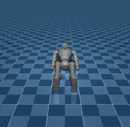</a><br/>
      <sub>Long Ho 01 002</sub>
    </td>
    <td align="center">
      <a href="doc/videos/long_ho_01_002_rd03_120hz_final.mp4">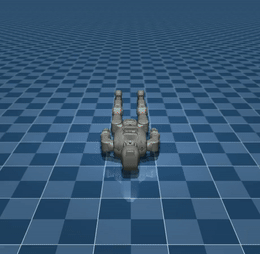</a><br/>
      <sub>Long Ho 01 002</sub>
    </td>
    <td align="center">
      <a href="doc/videos/long_ho_01_003_rd03_120hz.mp4">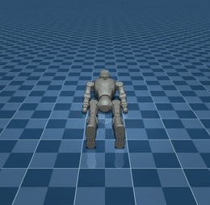</a><br/>
      <sub>Long Ho 01 003</sub>
    </td>
  </tr>
  <tr>
    <td align="center">
      <a href="doc/videos/long_ho_02_002_rd03_120hz.mp4">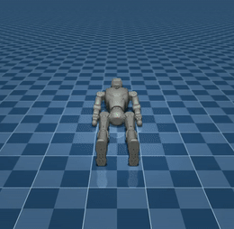</a><br/>
      <sub>Long Ho 02 002</sub>
    </td>
    <td align="center">
      <a href="doc/videos/long_ho_02_003_rd03_120hz.mp4"></a><br/>
      <sub>Long Ho 02 003</sub>
    </td>
    <td align="center">
      <a href="doc/videos/long_ho_03_002_rd03_120hz.mp4">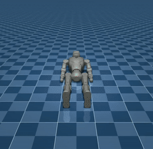</a><br/>
      <sub>Long Ho 03 002</sub>
    </td>
  </tr>
  <tr>
    <td align="center">
      <a href="doc/videos/long_ho_03_003_rd03_120hz.mp4">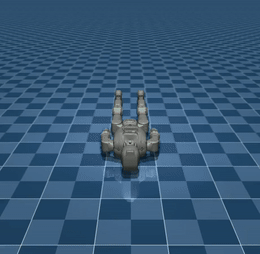</a><br/>
      <sub>Long Ho 03 003</sub>
    </td>
    <td align="center">
      <a href="doc/videos/ngu_mon_01_001_rd03_120hz.mp4">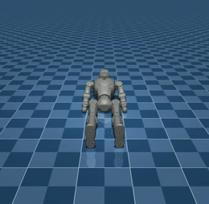</a><br/>
      <sub>Ngu Mon 01 001</sub>
    </td>
    <td align="center">
      <a href="doc/videos/ngu_mon_02_002_rd03_120hz.mp4">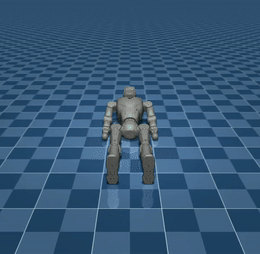</a><br/>
      <sub>Ngu Mon 02 002</sub>
    </td>
  </tr>
  <tr>
    <td align="center">
      <a href="doc/videos/ngu_mon_02_002_rd03_120hz_final.mp4">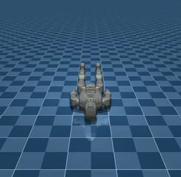</a><br/>
      <sub>Ngu Mon 02 002</sub>
    </td>
    <td align="center">
      <a href="doc/videos/nhap_mon_quyen_01_half_3_002_rd03_120hz_final.mp4">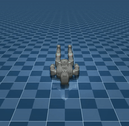</a><br/>
      <sub>Nhap Mon Quyen 01 Half 3 002</sub>
    </td>
    <td align="center">
      <a href="doc/videos/phan_the_1_004_new_5_rd03_120hz_final.mp4">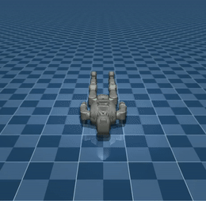</a><br/>
      <sub>Phan The 1 004 New 5</sub>
    </td>
  </tr>
  <tr>
    <td align="center">
      <a href="doc/videos/phan_the_1_004_rd03_120hz_final.mp4"></a><br/>
      <sub>Phan The 1 004</sub>
    </td>
    <td align="center">
      <a href="doc/videos/phan_the_1_005_rd03_120hz.mp4">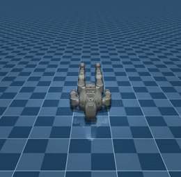</a><br/>
      <sub>Phan The 1 005</sub>
    </td>
    <td align="center">
      <a href="doc/videos/phan_the_2_003_rd03_120hz_final.mp4">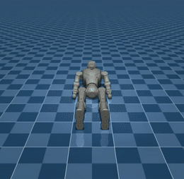</a><br/>
      <sub>Phan The 2 003</sub>
    </td>
  </tr>
  <tr>
    <td align="center">
      <a href="doc/videos/phan_the_2_004_rd03_120hz.mp4">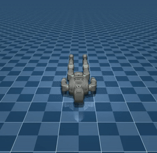</a><br/>
      <sub>Phan The 2 004</sub>
    </td>
    <td align="center">
      <a href="doc/videos/phan_the_3_004_rd03_120hz.mp4"></a><br/>
      <sub>Phan The 3 004</sub>
    </td>
    <td align="center">
      <a href="doc/videos/phan_the_3_004_rd03_120hz_final.mp4">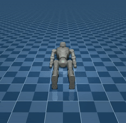</a><br/>
      <sub>Phan The 3 004</sub>
    </td>
  </tr>
  <tr>
    <td align="center">
      <a href="doc/videos/phan_the_3_rd03_120hz_final.mp4">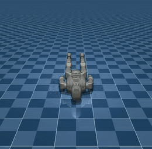</a><br/>
      <sub>Phan The 3</sub>
    </td>
    <td align="center">
      <a href="doc/videos/phan_the_4_004_rd03_120hz_final.mp4">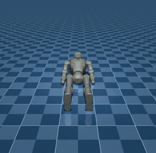</a><br/>
      <sub>Phan The 4 004</sub>
    </td>
    <td align="center">
      <a href="doc/videos/phan_the_4_005_rd03_120hz.mp4">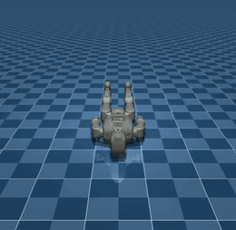</a><br/>
      <sub>Phan The 4 005</sub>
    </td>
  </tr>
  <tr>
    <td align="center">
      <a href="doc/videos/phan_the_4_005_rd03_120hz_final.mp4">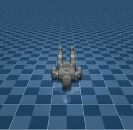</a><br/>
      <sub>Phan The 4 005</sub>
    </td>
    <td align="center">
      <a href="doc/videos/phan_the_4_006_rd03_120hz_final.mp4">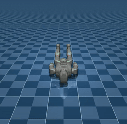</a><br/>
      <sub>Phan The 4 006</sub>
    </td>
    <td align="center">
      <a href="doc/videos/thap_tu_02_002_rd03_120hz_final.mp4">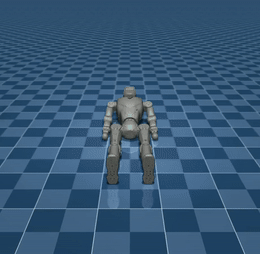</a><br/>
      <sub>Thap Tu 02 002</sub>
    </td>
  </tr>
</table>
